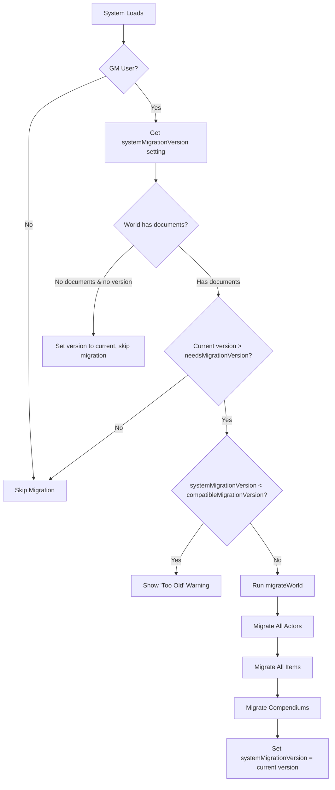

# Foundry VTT Migration System

_The Machine Spirit's Guide to Data Versioning and Upgrades_

## Overview

Foundry VTT provides a comprehensive migration system that allows game systems to upgrade user data when breaking changes are introduced. This document outlines the sacred protocols observed in the DND5e reference system and how to implement them for the Deathwatch system.

---

## Core Concepts

### 1. Version Tracking

**Document-Level Versioning (`_stats.systemVersion`)**
- Every Actor, Item, and Scene document stores the system version it was created/last migrated with in `document._stats.systemVersion`
- Foundry automatically updates this when documents are modified
- Migration functions check this version to determine which migrations to apply

**World-Level Versioning (`systemMigrationVersion` setting)**
- Single world setting: `game.settings.get("deathwatch", "systemMigrationVersion")`
- Stores the last system version that successfully migrated the world
- Set to current system version after world migration completes

### 2. Migration Trigger Flags (system.json)

```json
{
  "version": "5.3.2",
  "flags": {
    "needsMigrationVersion": "5.3.0",
    "compatibleMigrationVersion": "0.8"
  }
}
```

**`needsMigrationVersion`**: The system version that requires migration. If world's `systemMigrationVersion` is older than this, migration runs.

**`compatibleMigrationVersion`**: Minimum version that can be safely migrated. Worlds older than this show a "too old to migrate" warning.

---

## Migration Architecture (DND5e Pattern)

### File Structure

```
module/
├── migration.mjs                           # Main migration orchestration
├── settings.mjs                            # Register systemMigrationVersion setting
├── data/
│   ├── abstract/
│   │   └── system-data-model.mjs          # DataModel base class with _migrateData()
│   ├── actor/
│   │   └── character.mjs                  # Actor-specific migrations
│   └── item/
│       ├── weapon.mjs                     # Item-specific migrations
│       └── templates/
│           └── item-description.mjs       # Template-level migrations
dnd5e.mjs                                   # Main entry point: checks versions, triggers migration
```

### Migration Flow



---

## Implementation Steps for Deathwatch

### Step 1: Register Settings

**File**: `src/module/init/settings.mjs`

```javascript
export class SettingsRegistrar {
  static register() {
    // Internal System Migration Version
    game.settings.register("deathwatch", "systemMigrationVersion", {
      name: "System Migration Version",
      scope: "world",
      config: false,
      type: String,
      default: ""
    });

    // ... other settings ...
  }
}
```

### Step 2: Add Migration Flags to system.json

**File**: `src/system.json`

```json
{
  "version": "0.0.2",
  "flags": {
    "needsMigrationVersion": "0.0.2",
    "compatibleMigrationVersion": "0.0.1"
  }
}
```

### Step 3: Create Migration Module

**File**: `src/module/migration.mjs`

```javascript
import { Logger } from "./helpers/logger.mjs";

/**
 * Perform a system migration for the entire World.
 * @returns {Promise}
 */
export async function migrateWorld() {
  const version = game.system.version;
  const progress = ui.notifications.info(
    `Deathwatch System Migration: Upgrading to v${version}`,
    { permanent: true, console: false }
  );

  let hasErrors = false;
  const logError = (err, type, name) => {
    err.message = `Failed deathwatch migration for ${type} ${name}: ${err.message}`;
    Logger.error("MIGRATION", err);
    hasErrors = true;
  };

  // Migrate World Actors
  for (const actor of game.actors) {
    try {
      const source = actor.toObject();
      const updateData = migrateActorData(actor, source);
      if (!foundry.utils.isEmpty(updateData)) {
        Logger.info("MIGRATION", `Migrating Actor: ${actor.name}`);
        await actor.update(updateData, { enforceTypes: false, render: false });
      }
    } catch (err) {
      logError(err, "Actor", actor.name);
    }
  }

  // Migrate World Items
  for (const item of game.items) {
    try {
      const source = item.toObject();
      const updateData = migrateItemData(item, source);
      if (!foundry.utils.isEmpty(updateData)) {
        Logger.info("MIGRATION", `Migrating Item: ${item.name}`);
        await item.update(updateData, { enforceTypes: false, render: false });
      }
    } catch (err) {
      logError(err, "Item", item.name);
    }
  }

  // Migrate Compendium Packs
  for (const pack of game.packs) {
    if (pack.metadata.packageName !== "deathwatch") continue;
    if (!["Actor", "Item"].includes(pack.documentName)) continue;
    await migrateCompendium(pack);
  }

  // Set migration complete
  await game.settings.set("deathwatch", "systemMigrationVersion", version);
  ui.notifications.info(
    `Deathwatch System Migration Complete: v${version}`,
    { permanent: false }
  );
  Logger.info("MIGRATION", `World migration complete: v${version}`);
}

/**
 * Migrate a single Actor document.
 * @param {Actor} actor        The actor instance
 * @param {object} actorData   The actor source data
 * @returns {object}           Update data to apply
 */
export function migrateActorData(actor, actorData) {
  const updateData = {};
  const currentVersion = actorData._stats?.systemVersion;

  // Example migration: v0.0.1 -> v0.0.2
  // If actor is from v0.0.1, migrate characteristic.damage to characteristic.current
  if (foundry.utils.isNewerVersion("0.0.2", currentVersion)) {
    _migrateCharacteristicDamage(actorData, updateData);
  }

  // Migrate embedded items
  if (actorData.items) {
    const items = actor.items.reduce((arr, i) => {
      const itemData = i.toObject();
      const itemUpdate = migrateItemData(i, itemData);
      if (!foundry.utils.isEmpty(itemUpdate)) {
        arr.push({ ...itemUpdate, _id: itemData._id });
      }
      return arr;
    }, []);
    if (items.length) updateData.items = items;
  }

  return updateData;
}

/**
 * Migrate a single Item document.
 * @param {Item} item        The item instance
 * @param {object} itemData  The item source data
 * @returns {object}         Update data to apply
 */
export function migrateItemData(item, itemData) {
  const updateData = {};
  const currentVersion = itemData._stats?.systemVersion;

  // Example migration: v0.0.1 -> v0.0.2
  // Rename weapon.dmg to weapon.damage
  if (foundry.utils.isNewerVersion("0.0.2", currentVersion)) {
    if (itemData.type === "weapon" && "dmg" in itemData.system) {
      updateData["system.damage"] = itemData.system.dmg;
      updateData["system.-=dmg"] = null; // Delete old field
    }
  }

  return updateData;
}

/**
 * Migrate a compendium pack.
 * @param {CompendiumCollection} pack  The pack to migrate
 * @returns {Promise}
 */
export async function migrateCompendium(pack) {
  const documentName = pack.documentName;
  if (!["Actor", "Item"].includes(documentName)) return;

  const wasLocked = pack.locked;
  await pack.configure({ locked: false });

  const documents = await pack.getDocuments();
  for (const doc of documents) {
    try {
      const source = doc.toObject();
      const updateData =
        documentName === "Actor"
          ? migrateActorData(doc, source)
          : migrateItemData(doc, source);

      if (!foundry.utils.isEmpty(updateData)) {
        await doc.update(updateData, { diff: true });
        Logger.debug(
          "MIGRATION",
          `Migrated ${documentName} ${doc.name} in ${pack.collection}`
        );
      }
    } catch (err) {
      Logger.error(
        "MIGRATION",
        `Failed to migrate ${documentName} ${doc.name} in ${pack.collection}`,
        err
      );
    }
  }

  await pack.configure({ locked: wasLocked });
  Logger.info("MIGRATION", `Migrated compendium: ${pack.collection}`);
}

// ----------------------------------------
// Migration Helper Functions
// ----------------------------------------

/**
 * Migrate characteristic damage tracking (v0.0.1 -> v0.0.2).
 * Old: system.characteristics.str.damage
 * New: system.characteristics.str.current
 */
function _migrateCharacteristicDamage(actorData, updateData) {
  if (actorData.type !== "character") return;

  const characteristics = actorData.system?.characteristics;
  if (!characteristics) return;

  for (const [key, char] of Object.entries(characteristics)) {
    if ("damage" in char && !("current" in char)) {
      const current = char.value - (char.damage || 0);
      updateData[`system.characteristics.${key}.current`] = current;
      updateData[`system.characteristics.${key}.-=damage`] = null;
      Logger.debug("MIGRATION", `Migrated ${key} damage -> current for ${actorData.name}`);
    }
  }
}
```

### Step 4: Add Migration Trigger to Main Entry Point

**File**: `src/module/deathwatch.mjs`

```javascript
import * as migrations from "./migration.mjs";

// ... existing init hook ...

Hooks.once("ready", async function () {
  // ... existing ready code ...

  // Trigger migration (GM only)
  if (!game.user.isGM) return;

  const currentVersion = game.settings.get("deathwatch", "systemMigrationVersion");
  const totalDocuments = game.actors.size + game.items.size + game.scenes.size;

  // Brand new world with no documents: set version and skip migration
  if (!currentVersion && totalDocuments === 0) {
    return game.settings.set("deathwatch", "systemMigrationVersion", game.system.version);
  }

  // Check if migration is needed
  const needsMigration = game.system.flags.needsMigrationVersion;
  if (currentVersion && !foundry.utils.isNewerVersion(needsMigration, currentVersion)) {
    return; // Already migrated to this version
  }

  // Check if world is too old to migrate
  const compatibleVersion = game.system.flags.compatibleMigrationVersion;
  if (currentVersion && foundry.utils.isNewerVersion(compatibleVersion, currentVersion)) {
    return ui.notifications.error(
      `Your Deathwatch world is too old to migrate automatically (v${currentVersion}). ` +
      `Please contact the system developer for assistance.`,
      { permanent: true }
    );
  }

  // Run migration
  await migrations.migrateWorld();
});
```

### Step 5: DataModel-Level Migration (Optional)

For schema-level migrations that apply to all instances of a DataModel:

**File**: `src/module/data/actor/character.mjs`

```javascript
export class DeathwatchCharacter extends DeathwatchActorBase {
  // ... schema definition ...

  /** @override */
  static _migrateData(source) {
    super._migrateData(source);
    
    // Example: Migrate old field names
    if ("oldFieldName" in source) {
      source.newFieldName = source.oldFieldName;
      delete source.oldFieldName;
    }
  }
}
```

---

## Migration Best Practices

### 1. Version Comparisons

Always use `foundry.utils.isNewerVersion()` for version checks:

```javascript
// ✅ Correct
if (foundry.utils.isNewerVersion("0.0.2", currentVersion)) {
  // Apply migration
}

// ❌ Wrong (string comparison fails for "0.0.10" > "0.0.2")
if (currentVersion < "0.0.2") {
  // ...
}
```

### 2. Safe Property Access

Always check for property existence before migrating:

```javascript
// ✅ Correct
if ("oldField" in source.system && !("newField" in source.system)) {
  updateData["system.newField"] = source.system.oldField;
  updateData["system.-=oldField"] = null;
}

// ❌ Wrong (crashes if oldField doesn't exist)
updateData["system.newField"] = source.system.oldField;
```

### 3. Field Deletion

Use Foundry's `.-=fieldName` syntax to delete old fields:

```javascript
updateData["system.-=oldFieldName"] = null;
```

### 4. Non-Destructive Updates

Only apply updates if the field needs migration:

```javascript
// ✅ Correct
if (!foundry.utils.isEmpty(updateData)) {
  await actor.update(updateData);
}

// ❌ Wrong (triggers update even if no changes)
await actor.update(updateData);
```

### 5. Error Handling

Wrap migrations in try-catch and continue on failure:

```javascript
for (const actor of game.actors) {
  try {
    // ... migration logic ...
  } catch (err) {
    console.error(`Failed to migrate actor ${actor.name}:`, err);
    // Continue with next actor
  }
}
```

---

## Testing Migrations

### 1. Create Test World

1. Create a new world with Deathwatch v0.0.1
2. Add test actors/items with old data structure
3. Export the world
4. Upgrade system to v0.0.2
5. Import the world and verify migration runs correctly

### 2. Migration Verification

Check that:
- `systemMigrationVersion` setting is updated to new version
- All actors/items have `_stats.systemVersion` = new version
- Old fields are removed (`.-=oldField`)
- New fields are populated correctly
- No console errors during migration

### 3. Compendium Testing

- Verify compendium packs are migrated
- Check that locked packs are handled correctly
- Ensure pack lock status is restored after migration

---

## Common Migration Scenarios

### Scenario 1: Rename Field

```javascript
// Old: system.dmg
// New: system.damage
if ("dmg" in source.system && !("damage" in source.system)) {
  updateData["system.damage"] = source.system.dmg;
  updateData["system.-=dmg"] = null;
}
```

### Scenario 2: Change Data Type

```javascript
// Old: system.equipped = false (boolean)
// New: system.equipped = true (default true)
if (foundry.utils.getType(source.system.equipped) === "boolean") {
  updateData["system.equipped"] = source.system.equipped ? 1 : 0;
}
```

### Scenario 3: Restructure Nested Data

```javascript
// Old: system.armor = 5
// New: system.armor = { value: 5, naturalArmor: 0 }
if (Number.isNumeric(source.system.armor)) {
  updateData["system.armor"] = {
    value: source.system.armor,
    naturalArmor: 0
  };
}
```

### Scenario 4: Migrate Array to Object

```javascript
// Old: system.skills = ["awareness", "command"]
// New: system.skills = { awareness: {...}, command: {...} }
if (Array.isArray(source.system.skills)) {
  const skillsObject = {};
  for (const skillKey of source.system.skills) {
    skillsObject[skillKey] = { value: 0, advances: 0 };
  }
  updateData["system.skills"] = skillsObject;
}
```

---

## Version Numbering Strategy

### Semantic Versioning (Recommended)

**Format**: `MAJOR.MINOR.PATCH`

- **MAJOR**: Breaking changes that require migration (e.g., v1.0.0 → v2.0.0)
- **MINOR**: New features, backward-compatible (e.g., v1.0.0 → v1.1.0)
- **PATCH**: Bug fixes, no migration needed (e.g., v1.0.0 → v1.0.1)

**Migration trigger**: Only increment `needsMigrationVersion` for MAJOR/MINOR changes that modify data structure.

### Example Version History

```json
// v0.0.1 (Initial release)
{ "version": "0.0.1", "flags": { "needsMigrationVersion": "0.0.1" } }

// v0.0.2 (Bug fixes, no data changes)
{ "version": "0.0.2", "flags": { "needsMigrationVersion": "0.0.1" } }

// v0.1.0 (New feature: characteristic damage → current)
{ "version": "0.1.0", "flags": { "needsMigrationVersion": "0.1.0" } }

// v1.0.0 (Major rewrite: new schema)
{ "version": "1.0.0", "flags": { "needsMigrationVersion": "1.0.0", "compatibleMigrationVersion": "0.1.0" } }
```

---

## Deployment Checklist

Before releasing a version that requires migration:

- [ ] Update `version` in `system.json`
- [ ] Update `needsMigrationVersion` in `system.json` (if data structure changed)
- [ ] Implement migration functions in `migration.mjs`
- [ ] Test migration on a copy of production world
- [ ] Document breaking changes in CHANGELOG.md
- [ ] Backup user worlds (add migration warning to release notes)
- [ ] Monitor Discord/GitHub for migration issues after release

---

## Future Considerations

### Foundry v14+ Changes

Foundry v14 may introduce changes to the migration system. Monitor the Foundry API changelog and adjust accordingly.

### Automatic Backups

Consider implementing automatic world backup before migration:

```javascript
// Future enhancement: backup world before migration
async function migrateWorld() {
  await game.socket.emit("exportWorld"); // Trigger automatic backup
  // ... migration logic ...
}
```

### Migration UI

For complex migrations, consider a custom UI:

```javascript
// Future enhancement: show migration progress UI
const migrationDialog = new MigrationProgressDialog({
  title: "Deathwatch System Migration",
  actors: game.actors.size,
  items: game.items.size,
  packs: game.packs.filter(p => p.metadata.packageName === "deathwatch").length
});
migrationDialog.render(true);
```

---

_The Machine Spirit has spoken. May these sacred protocols guide your upgrades without corruption._

_Praise the Omnissiah. 🔧⚙️_
